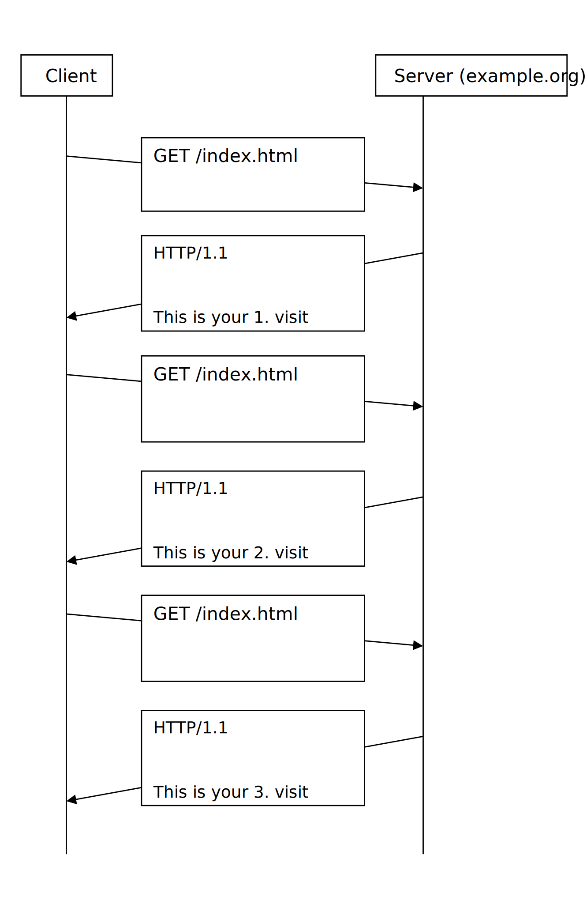

## 🔽 Tutorial 03 🔒

**URL & HTTP**

---

### Task 1

1. Answer the following questions briefly and accurately in your own words:
   - What is the difference between URI and URL?
   - What is the meaning of the URL scheme?
   - What, why and how should be encoded in URLs?
2. Implement a class for parsing and generation of HTTP URLs. Use the given **Task1-Template.zip** as a start point:
   - The constructor `Url(string urlStr)` should split the `urlStr` into URL components using a **regular expression** and fill in the instance variables `Scheme`, `Host` etc. One should assume the URL is correctly encoded.
   - The function `string ToString()` should concat the instance variables to the string representation of the URL.
   - The static method `string Encode(string s)` should convert all characters from `s`, which are not in `VALID_CHARACTERS` into the %-form and give the resulting string back.
   - The static method `string Decode(string s)` should convert all %-escaped characters from `s` and give the resulting string back.

> ℹ️ **Info**
> _For simplification purposes, it is enough that the given unit test passes (the solution should not be limited to the given URL though)._

### Task 2

1. Explain the semantics of the following HTTP methods: GET, HEAD, PUT, DELETE, and POST. Which of them are **safe**, which are **idempotent**, and which are **cacheable**?
2. Explain the purpose of the following HTTP headers briefly and accurately in your own words:
   - Host
   - Content-Type
   - Content-Length
   - Accept
   - User-Agent
   - Location

### Task 3

Implement an HTTP message parser and builder based on the template **Task3-Template.zip** (take care of differentiation between request and response messages). Complete the methods _Parse_ and _ToString_.

[Image of HTTP request and response message structure]

### Task 4

Answer the following questions briefly and accurately in your own words:

1. What are the goals of HTTPS and how they are achieved?
2. What is the difference between HTTP and HTTPS request/response messages?
3. What is the purpose of HTTP cookies? Answer briefly and accurately in your own words.
4. Consider the following scenario: A client requests the same resource on the server for several times. Each time he requests a resource, the number of prior requests is returned in the resource representation. Complete the following diagram with missing HTTP headers and status codes required for implementation of the above scenario:

5. Extend the template **Task4-Template.zip** towards the above scenario.
