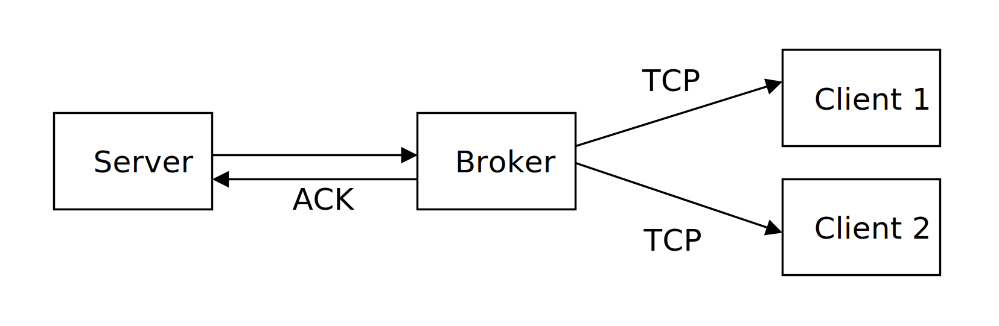

## 🔽 Tutorial 04 🔒

**Cookie, SOAP & MEP**

---

### Task 1

1. Answer the following questions briefly and accurately in your own words.
   - What is SOAP?
   - Where would you situate SOAP within the Internet Protocol stack?
   - Which parts are in a SOAP Message?

2. Use the following link to access a simulator and get a first hands-on experience with SOAP:

   [https://barsch.informatik.tu-chemnitz.de/?scenario_url=https%3A%2F%2Fbarsch.informatik.tu-chemnitz.de%2FScenarios%2Fsse4.json](https://barsch.informatik.tu-chemnitz.de/?scenario_url=https%3A%2F%2Fbarsch.informatik.tu-chemnitz.de%2FScenarios%2Fsse4.json)

   After the simulator has loaded and you can see the client and service:
   - Click on the client
   - In the right sidebar is the client's application code
   - Within the application code, fill out the two SOAP envelopes
   - Test your solution by clicking on "Start" in the header
   - Use Pause / Continue in the header to control the simulation
   - You can inspect the message contents by clicking on them
   - After making changes, click Reset to start the simulation again

   Your task will be to complete the SOAP envelopes to do the following:
   1. Invoke a "Ping" Request
   2. Invoke a "Echo" Request with a Parameter "Value", using a suitable value

   For the elements of the Request, use the XML Namespace "http://example.com/"

> ℹ️ **Note**
> The service will respond with fault messages (colored in red) if there are any issues with your request!

### Task 2

1. Under [http://vsr-demo.informatik.tu-chemnitz.de/webservices/SoapWebService/Service.asmx](http://vsr-demo.informatik.tu-chemnitz.de/webservices/SoapWebService/Service.asmx) you will find a simple Web service, which is able to compute a sum of two integers (the Add operation). Implement a client for sending SOAP 1.2 requests to the above service based on the template **Task2.1-Template.zip**. Print the result of the calculation to the console. Send manually constructed SOAP messages over HTTP – do not use any code-generation tools or third party libraries.
2. Complete the `SoapClient.Invoke` method of the **Task2.2-Template.zip** project, which should be able to send requests to ANY SOAP service using given service URL, service namespace, operationName and named parameters list (for simplicity request and response parameters can be only strings or integers). Test your class on the service above and the ConcatenatorService under [http://vsr-demo.informatik.tu-chemnitz.de/webservices/ConcatenatorService/ConcatenatorService.asmx](http://vsr-demo.informatik.tu-chemnitz.de/webservices/ConcatenatorService/ConcatenatorService.asmx)

> ℹ️ **Info**
> The services are accessible from university network or over VPN.

### Task 3

The project **Task3-Template.zip** contains a distributed system including a server, a broker and two clients. The Server sends regular stock price updates to the broker, which distributes them to the both clients. The broker is often overloaded and therefore the server should retransmit the message if broker doesn't acknowledge the message receipt (robust one-way MEP). The communication between the broker and clients should follow simple one-way MEP.

1. Extend the `ReceiveMessage` method of the broker to send SOAP-based receipt notifications back to the server (BUSY or RECIEVED) (cf. [http://www.w3.org/TR/xmlp-scenarios/#S5](http://www.w3.org/TR/xmlp-scenarios/#S5) for examples).
2. The broker should not be able to read the contents of some SOAP messages. Update the server and client 1 to use shared secret to encrypt and decrypt contents of SOAP messages (You can use _Encryption.Encrypt_ and _Encryption.Decrypt_ methods).
3. Client 2 should not be equipped with any encryption/decryption facilities and therefore ignore encrypted messages. Make server send appropriate SOAP headers to signal the need of decrypting content before processing it.
